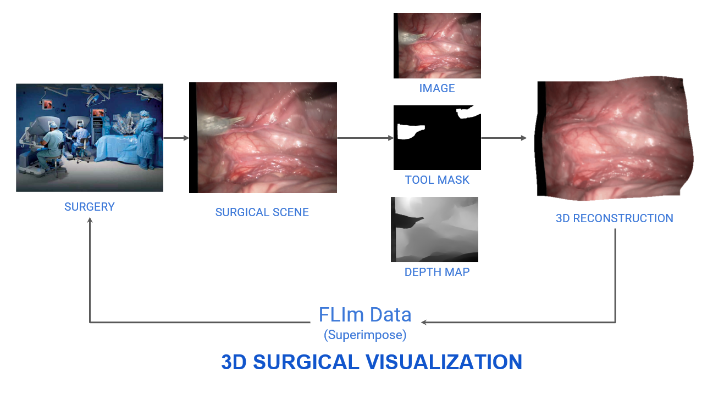
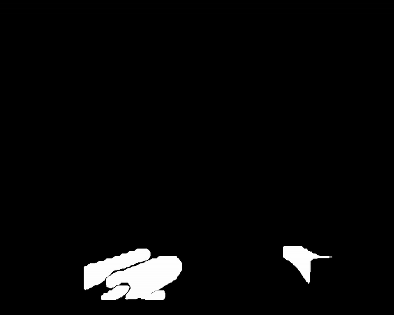
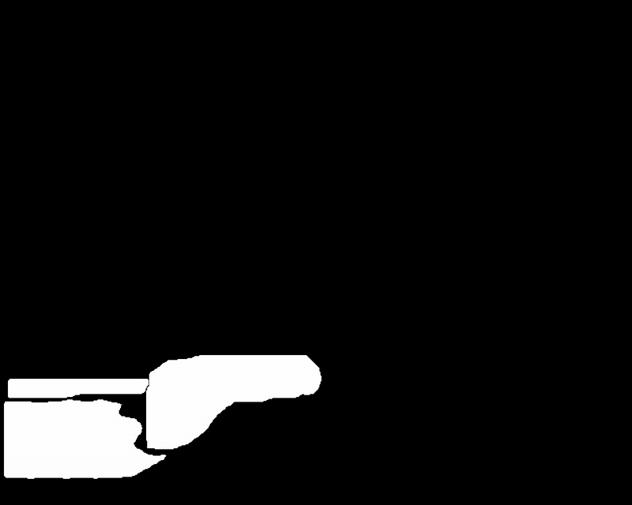

# YOLOv8 Segmentation for Real-Time 3D Endoscopic Scene Reconstruction

## 🎥 Overview

This section explains the **YOLOv8 segmentation** process used in the **DynamicSurg3D** project. We leverage YOLOv8 to extract relevant features from endoscopic video frames, enabling **real-time semantic segmentation** for **3D scene reconstruction**. This helps in filtering out irrelevant regions and refining the reconstruction process.

---

## 📌 Pipeline Diagram

Below is the pipeline workflow depicting how the YOLOv8 segmentation integrates into the 3D reconstruction process.

1. **Input Video Frame** 🎥 → Raw surgical video input.
2. **YOLOv8 Inference** ⚡ → Detects and segments relevant surgical objects.
3. **Mask Processing** 🎭 → Converts segmented objects into grayscale masks.
4. **Depth Extraction** 📏 → Combines with **Depth-Anything** model to estimate depth.
5. **Point Cloud Generation** 🌍 → 3D scene construction using depth and segmentation.
6. **Visualization & Interaction** 🖥️ → Provides real-time 3D reconstruction.

---

## 🔍 YOLOv8 Segmentation Process

### 1️⃣ **Preprocessing the Input Video**
- Convert the raw endoscopic video into **individual frames**.
- Resize frames for optimal YOLOv8 performance.

### 2️⃣ **Running YOLOv8 for Segmentation**
- Use a pre-trained **YOLOv8-seg** model to extract surgical tools and regions.

### 3️⃣ **Generating Segmentation Masks**
- Convert detected masks into grayscale binary images for further processing.
- Assign unique colors to different surgical components for clear visualization:
  - **Aiming Beam:** 🟡 Yellow
  - **Laser Probe:** 🔴 Red
  - **Da Vinci Surgical Robotic Arms/Instruments:** 🔵 Light Cyan
  - **Laser Power Supply:** 🟣 Pink

### 4️⃣ **Combining with Depth Information**
- Merge segmentation with depth maps to refine **3D reconstruction**.

---
## 🖼️ Visual Examples

### Original Video Frame 🎥

### YOLOv8 Segmentation Outputs

#### 1️⃣ **Colored Segmentation Output** 🎨
- Highlights surgical instruments in distinct colors according to class labels.

**Segmentation Example:**

  <table>
    <tr>
      <td></td>
      <td></td>
    </tr>
  </table>

#### 2️⃣ **Colored Transparent Segmentation** 🌀
- Overlays segmentation on the original frame while keeping transparency.

**Segmentation Example:**

  <table>
    <tr>
      <td></td>
      <td></td>
    </tr>
  </table>

#### 3️⃣ **Binary Segmentation Output** ⚫⚪
- Converts instruments to white and background to black for clarity.

**Segmentation Example:**

  <table>
    <tr>
      <td></td>
      <td></td>
    </tr>
  </table>

---

## 🚀 Next Steps
- **Enhance segmentation accuracy** by fine-tuning YOLOv8 on surgical datasets.
- **Optimize depth refinement** by integrating additional post-processing techniques.
- **Improve real-time performance** using parallel processing and GPU acceleration.

This YOLO segmentation approach significantly improves the **DynamicSurg3D** system’s ability to process complex surgical scenes efficiently. 🎯

